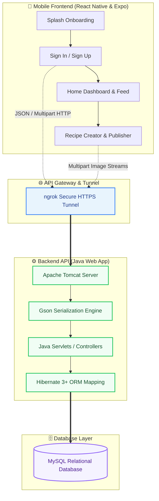

# 🍳 Flavor Palette — Full-Stack Recipe Platform

Welcome to the official repository of **Flavor Palette**, a complete, modern, full-stack recipe discovery and sharing platform. This repository is structured as a **unified monorepo**, housing both the highly responsive React Native mobile application and the enterprise-grade Java backend API.

---

## 🗺️ System Architecture (Sketch)

The platform is designed with a decoupled architecture where the mobile client communicates asynchronously with a Java Servlet API container over a secure network layer (tunnelling local environments via `ngrok`).



---

## 📂 Repository Layout

This monorepo is cleanly divided into two specialized directories:

| Directory | Component | Primary Tech Stack | Documentation Link |
| :--- | :--- | :--- | :--- |
| **[`/frontend`](./frontend)** | Mobile Client App | React Native, Expo SDK 53, TypeScript, NativeWind, React Navigation | [Frontend README 📱](./frontend/README.md) |
| **[`/backend`](./backend)** | Core Web API | Java Servlets, Hibernate ORM, MySQL Database, Google Gson | [Backend README ⚙️](./backend/README.md) |

---

## ✨ Features Checklist

- [x] **Secure User Authentication**: Complete Sign In & Sign Up pipeline with regex-backed validation.
- [x] **City-Based User Profiling**: Dynamic city-list query lookup linked to relational DB profiles.
- [x] **Recipe Publisher Engine**: High-fidelity form submitting serving metrics, calorie estimations, ingredients list, cooking directions, and full-resolution image streams.
- [x] **Personalized Dashboards**: User dashboard showing custom stats, custom avatars, and self-authored recipes.
- [x] **Database Relation Mappings**: Full ER diagram database configurations using Hibernate mappings.

---

## ⚡ Prerequisites

To run this full-stack application on your local machine, ensure you have installed:
*   **For Frontend:** [Node.js](https://nodejs.org/) (v18 or v20+) and [Expo Go](https://expo.dev/client) app on your mobile device.
*   **For Backend:** Java Development Kit (JDK 8 or above), [NetBeans IDE](https://netbeans.apache.org/) (with Ant), [Apache Tomcat](https://tomcat.apache.org/) (v9 or above), and [MySQL Server](https://www.mysql.com/).

---

## 🚀 Quick Execution Guide

### 1. Boot up the Backend Database & API
1. Setup your MySQL server and configure a new schema named `recipeapp`.
2. Open the `/backend` project in **NetBeans IDE**.
3. Configure database connection parameters inside [`/backend/src/java/hibernate/hibernate.cfg.xml`](./backend/src/java/hibernate/hibernate.cfg.xml).
4. Build and Run the project to deploy onto Apache Tomcat on `http://localhost:8080/RecipeApp`.
5. Start your `ngrok` tunnel to map to the local port:
   ```bash
   ngrok http 8080
   ```

### 2. Launch the Mobile Client
1. Configure your local environment file [`/frontend/.env`](./frontend/.env) using the HTTPS URL generated by ngrok.
2. Open your terminal in the `/frontend` directory and install dependencies:
   ```bash
   npm install
   ```
3. Boot up the developer server:
   ```bash
   npx expo start --clear
   ```
4. Scan the QR code with your mobile camera to run the app instantly via **Expo Go**!

---

*For detailed instructions on configuring components, endpoints, database schemas, and folder structures, please refer directly to the respective README files inside [**`/frontend`**](./frontend/README.md) and [**`/backend`**](./backend/README.md).*
