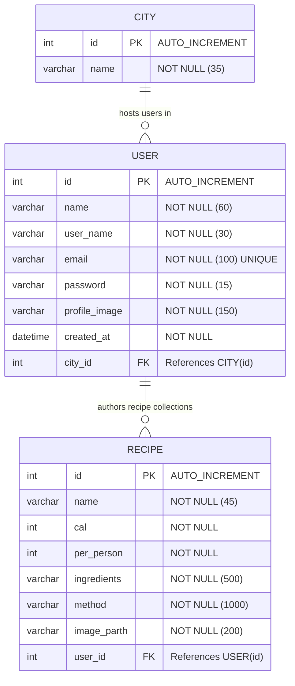

# ⚙️ Flavor Palette — Java Backend API

> A robust, high-performance Java Web API powering the **Flavor Palette** mobile client. Utilizing **Java Servlets**, **Hibernate ORM**, **MySQL Persistence**, and **Google Gson** to handle high-throughput authentication, user management, and multimedia uploads. Built using the structured Ant engine within NetBeans IDE.

---

## 🛠️ Technology Strategy

The backend layer leverages established, enterprise-level Java enterprise tools to ensure extreme transactional reliability, high database performance, and robust security.

| Technology | Role | Strategy & Features |
| :--- | :--- | :--- |
| **Java EE Servlets** | REST API Layer | Handles HTTP request processing pipelines. Provides annotations like `@WebServlet` for clean endpoint registration. |
| **Hibernate 3+ ORM** | Object-Relational Mapping | Abstracts low-level SQL. Controls sessions via `HibernateUtil` and auto-manages object graphs. |
| **MySQL (v8.0)** | Relational Persistence | Relational database schema with indexes on foreign keys to support fast joins and subsecond query speeds. |
| **Google Gson** | Serialization Engine | High-speed processing of requests and response conversions from Java classes to JSON payloads. |
| **Multipart Streaming**| File Upload System | Utilizes `@MultipartConfig` stream handling to write user profile and recipe photos directly to server web folders. |

---

## 🗄️ Database & Schema Architecture (Sketch)

The persistence model consists of a highly cohesive three-tier relational schema mapped perfectly through Hibernate entities (`City`, `User`, `Recipe`).



---

## 📂 Project Structure

Below is the directory map of the NetBeans-managed Java Enterprise Web project:

```text
d:\ApowerRECData\RecipeApp
├── nbproject/               # NetBeans project configuration metadata files (Git-ignored: private/)
├── lib/                     # Dependency external archive jar files (Hibernate, MySQL Connector, Gson)
├── src/                     # Java Source Code Directory
│   └── java/                # Main package directories
│       ├── conf/            # Build configurations
│       ├── controller/      # Web controller servlets handling client API requests
│       │   ├── Cities.java         # GET: Fetches lookup list of all registered cities
│       │   ├── SignIn.tsx          # POST: User authentication credentials validator
│       │   ├── NewAccount.java     # POST [Multipart]: Configures new user profile & uploads photo
│       │   ├── AddNewResipe.java   # POST [Multipart]: Saves new recipe configuration with photo
│       │   └── LoadUserData.java   # GET: Feeds user profile metadata and individual recipes list
│       ├── hibernate/       # Entity mappings and helper database classes
│       │   ├── City.java           # City entity mapped to database table 'city'
│       │   ├── User.java           # User entity mapped to database table 'user'
│       │   ├── Recipe.java         # Recipe entity mapped to database table 'recipe'
│       │   ├── HibernateUtil.java  # SessionFactory generator helper instance manager
│       │   └── hibernate.cfg.xml   # Primary database credentials & dialect mapping manifest
│       └── model/           # Utility classes supporting application controllers
│           └── Util.java           # Validation helpers (validates email structure, passwords etc.)
├── web/                     # Web deployment root containing build assets
│   ├── WEB-INF/             # Private server config configurations (web.xml etc.)
│   ├── profile_image/       # Server media folder containing user profile uploads (Git-ignored)
│   └── recipe_image/        # Server media folder containing recipe image uploads (Git-ignored)
├── build.xml                # Ant script orchestrating compiling, packing and deploying projects
└── .gitignore               # Excludes compiled .class files, local logs, and local builds (Created)
```

---

## 📡 API Endpoints Documentation

All endpoints receive requests and respond via JSON or multipart binary formats.

### 1. Retrieve Cities
*   **Endpoint:** `/Cities`
*   **Method:** `GET`
*   **Description:** Fetches all cities registered in the MySQL database to populate signup dropdown selectors.
*   **Response Payload (`application/json`):**
    ```json
    [
      { "id": 1, "name": "Colombo" },
      { "id": 2, "name": "Kandy" }
    ]
    ```

### 2. User Sign-In
*   **Endpoint:** `/SignIn`
*   **Method:** `POST`
*   **Description:** Authenticates user credentials.
*   **Request Payload (`application/json`):**
    ```json
    {
      "email": "user@example.com",
      "password": "Password123#"
    }
    ```
*   **Response Payload (`application/json`):**
    ```json
    {
      "status": true,
      "message": "SignIn Successful"
    }
    ```

### 3. Register New Account
*   **Endpoint:** `/NewAccount`
*   **Method:** `POST`
*   **Content-Type:** `multipart/form-data`
*   **Request Fields:**
    *   `fullName` (text)
    *   `userName` (text)
    *   `email` (text)
    *   `password` (text)
    *   `confirmpassword` (text)
    *   `city` (text representing City ID, e.g. `"1"`)
    *   `profileImage` (binary image file payload)

### 4. Add New Recipe
*   **Endpoint:** `/AddNewResipe`
*   **Method:** `POST`
*   **Content-Type:** `multipart/form-data`
*   **Request Fields:**
    *   `name` (text, e.g. "Spiced Curry")
    *   `person` (text number of servings, e.g. `"4"`)
    *   `cal` (text representing calories count, e.g. `"450"`)
    *   `ingri` (text representing instructions/ingredients list)
    *   `method` (text representing steps description)
    *   `UserId` (text representing numeric creator ID, e.g. `"12"`)
    *   `profileImage` (binary recipe image file payload)

---

## ⚙️ Environment Setup & Running locally

### 1. Database Setup
1. Open your MySQL client (e.g. MySQL Workbench, phpMyAdmin, or terminal).
2. Create the target schema:
   ```sql
   CREATE DATABASE recipeapp;
   ```
3. Create the tables and relations as configured under `d:\ApowerRECData\RecipeApp\src\java\hibernate\`.
4. Ensure the `city` table has initial mock records:
   ```sql
   INSERT INTO city (name) VALUES ('Colombo'), ('Kandy'), ('Galle'), ('Negombo');
   ```

### 2. Configure Hibernate Connections
Open `d:\ApowerRECData\RecipeApp\src\java\hibernate\hibernate.cfg.xml` and update the connection attributes if your local database credentials differ:
```xml
<property name="hibernate.connection.url">jdbc:mysql://localhost:3306/recipeapp?useSSL=false</property>
<property name="hibernate.connection.username">YOUR_DATABASE_USERNAME</property>
<property name="hibernate.connection.password">YOUR_DATABASE_PASSWORD</property>
```

### 3. Server Deployment (NetBeans IDE)
1. Open the **NetBeans IDE**.
2. Select **File -> Open Project** and navigate to `d:\ApowerRECData\RecipeApp`.
3. Right-click on the project root in the explorer panel.
4. Select **Resolve Problems** if any library archives (JARs) under the `lib` folder show exclamation marks.
5. Right-click the project name and select **Run**. NetBeans will compile, package it into a `.war` file, and deploy it onto your default configured server (e.g., Apache Tomcat on port `8080`).

---

## 👩‍💻 Developer

*   **Ashini Sudusingha** — *Lead Full-Stack Software Engineer*
    *   **GitHub / Portfolio:** [@Ashini-Sudusingha](https://github.com/Ashini-Sudusingha)
    *   **Contributions:** Designed and engineered the Java Servlet API layer, Hibernate 3+ database persistence mappings, and MySQL relational database configuration.

