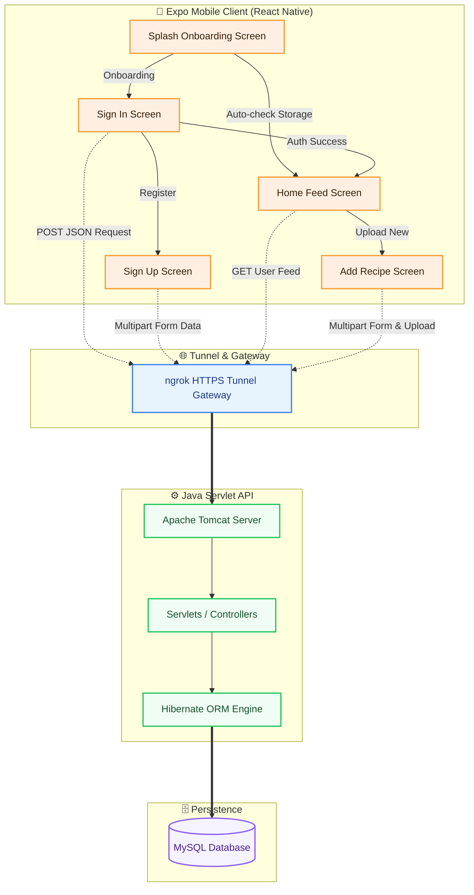

# 🍳 Flavor Palette — Mobile Application

> A premium, high-performance, and feature-rich React Native mobile client for **Flavor Palette**, built with **Expo**, **TypeScript**, and **NativeWind (Tailwind CSS)**. Designed with fluid animations and responsive layout structures to deliver a modern, state-of-the-art user experience for recipe sharing.

---

## 🎨 Technology Strategy

The frontend engineering strategy centers around **modular architecture**, **static type safety**, and **rich visual aesthetics**. Below are the key pillars of our frontend tech stack:

| Core Technology | Purpose | Key Benefits |
| :--- | :--- | :--- |
| **React Native (v0.79) & Expo (v53)** | Core framework & runtime environment | Fast iteration, unified codebase, and seamless native performance. |
| **TypeScript** | Type-safe application development | Compile-time checks, auto-completion, and bulletproof scalability. |
| **NativeWind / TailwindCSS** | Styling framework | Curated visual design system, glassmorphism, responsive styles, and flexible control. |
| **React Navigation (v7)** | Native routing & transitions | Fluid screen stacks, hardware back-button handling, and hardware acceleration. |
| **AsyncStorage** | Local client state persistence | Caches session credentials (like `email`) to remember signed-in users on boot. |
| **Reanimated & Alert Notification**| Premium UI micro-animations & Toast | Smooth interactive loops and responsive alert banners. |

---

## 🗺️ System & Communication Architecture (Sketch)

The mobile client interfaces with the local Java backend through a secure **ngrok tunnel**, allowing the mobile device (or emulator) to securely communicate with the local servlet container.



---

## 📂 Project Structure

A clean, modular layout has been established to separate concerns, keeping UI screens, navigation systems, assets, and business logic decoupled.

```text
d:\HHDP1\RecipeApp
├── .expo/                   # Expo dev server builds and cached compilation metadata
├── assets/                  # Shared system-wide app assets & launcher icons
├── src/                     # Core Application Source Code
│   ├── assets/              # Interface media resources (backgrounds, illustrations)
│   │   └── images/          # Image files e.g., back1.jpg, splash.jpg
│   ├── fonts/               # Modern Google Fonts (e.g., Outfit, Inter)
│   └── screens/             # Dedicated App Screen Component layers
│       ├── Splash.tsx       # Entrance screen with onboarding choices & session checks
│       ├── SignIn.tsx       # Secure credentials login using async networking
│       ├── SignUp.tsx       # New account configuration including city picker & profile image upload
│       ├── Home.tsx         # Dashboard feed displaying custom user profile & recipe collections
│       └── AddRecipe.tsx    # High-quality recipe publisher (inputs for ingredients, methods, and photos)
├── App.tsx                  # Root entry-point compiling Navigation Containers & Route stacks
├── app.json                 # Standard Expo manifest specifying SDK configurations, icons, and bundles
├── package.json             # Workspace dependencies list and automation build scripts
├── tsconfig.json            # Static type validation configurations for TypeScript compilers
└── .gitignore               # Complete Git ignored resources config file (Updated)
```

---

## 🔐 Environment Strategy

> [!WARNING]
> Currently, the application contains hardcoded network endpoints referencing temporary `ngrok` tunnels (e.g., `https://7a71c2478d4d.ngrok-free.app`). Putting these hardcoded URLs in source control can cause broken runs when tunnel sessions reset.

To achieve enterprise-grade codebase hygiene, you should adopt the **Expo environment strategy** implemented below:

### 1. Create your Local Environment Config
Create a file named `.env` in the root folder (`d:\HHDP1\RecipeApp\.env`):

```env
# Base Gateway API endpoint of your ngrok tunnel or Localhost
EXPO_PUBLIC_API_URL=https://YOUR_SUBDOMAIN.ngrok-free.app/RecipeApp
```
*Note: Since the `.gitignore` has been updated to ignore all `.env` files, this configuration will safely reside on your local machine only.*

### 2. Refactor Codebase to use the environment variables
Replace static references with dynamic process variables. For instance, inside `SignIn.tsx` and other screens:

```diff
-const response = await fetch(
-    "https://7a71c2478d4d.ngrok-free.app/RecipeApp/SignIn",
-    {
-        method: "POST",
-        body: signInJson,
-        headers: {
-            "Content-Type": "miltipart/formdata",
-        },
-    }
-);
+const API_BASE_URL = process.env.EXPO_PUBLIC_API_URL;
+const response = await fetch(
+    `${API_BASE_URL}/SignIn`,
+    {
+        method: "POST",
+        body: signInJson,
+        headers: {
+            "Content-Type": "multipart/form-data",
+        },
+    }
+);
```

---

## 🚀 Execution & Setup Guide

Ensure you have [Node.js](https://nodejs.org/) (v18 or v20+) installed on your PC.

### 1. Install Project Dependencies
Navigate to the root directory and install all node packages:
```bash
npm install
```

### 2. Start the Metro Bundler
Launch the Expo interactive developer dashboard and packager:
```bash
npx expo start --clear
```

### 3. Open on Devices / Simulators
Inside the terminal, select your target compilation environment:
*   Press **`a`** to build and run on an **Android Emulator** or physical USB device.
*   Press **`i`** to compile and run on an **iOS Simulator**.
*   Press **`w`** to render a preview draft in the **Web Browser**.
